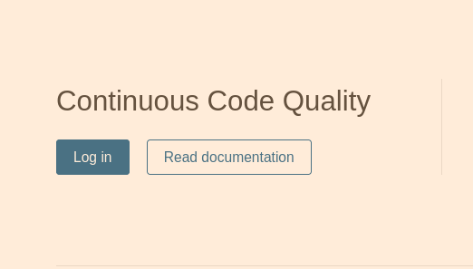

# Run SonarQube locally
All instructions based at an article at https://www.vogella.com/tutorials/SonarQube/article.html

## Configure and run SonarQube locally
* Create and run SonarQube container
    ```
        make create-sonarqube
    ```
* Configure SonarQube

    a). Log in at http://localhost:9000
    
     
        
        Username: admin
        Password: admin
    
    b). Create a new Sonar project.
    
    
    
    - Set project name
    
    
    
    - Generate token
    
    
    
    You should see
    
    
    
    - Select code language and building technology
    
    
        
    c). Run code analyse using command from a previous step. 
    
    Before code analyse ALWAYS execute:
    
    ```
        mvn clean test
    ```
  
    Next (from previous step): 
    ```
    mvn sonar:sonar \
      -Dsonar.projectKey=pnf-simulator \
      -Dsonar.host.url=http://localhost:9000 \
      -Dsonar.login=de5dac7da79a4de88876006a05457902aab1a3a3
    ```
    After command execution you should see at the console:
    ```
    [INFO] ANALYSIS SUCCESSFUL, you can browse http://localhost:9000/dashboard?id=pnf-simulator
    [INFO] Note that you will be able to access the updated dashboard once the server has processed the submitted analysis report
    ```
    Click at link http://localhost:9000/dashboard?id=pnf-simulator to see Sonar report
    
        
    IMPORTANT: Please note command used to run code analise. You will need it later.  
      
## Stopping SonarQube
If you do not want to repeat step **Configure and run SonarQube locally** you must use stopping and starting make goals.
```
   make stop-sonarqube
```

## Starting SonarQube
If you do not want to repeat step **Configure and run SonarQube locally** you must use stopping and starting make goals.
```
   make start-sonarqube
```
